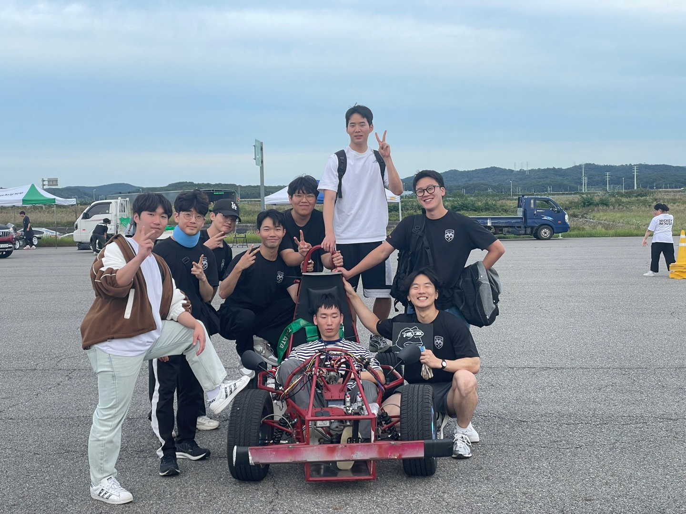
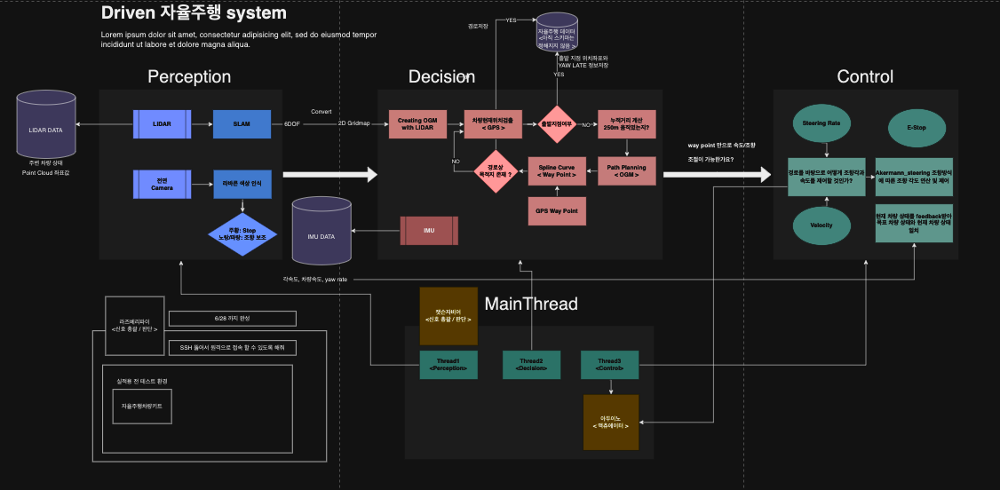

# Driven_autonomous_driving

2023 대학생 창작 모빌리티 경진대회 자율주행 부문 한국기술교육대학교 Driven

<details>
<summary>팀 이름이 "바퀴벌레" 인 이유는 ?</summary>
<div markdown="1">
* 이태원에서 진짜 장난안하고 엄지손가락만한 바퀴벌레를 잡았음. 누가 설명좀.
</div>
</details>


[ Driven 자율주행 팀 회고 ](https://h17.notion.site/Driven-2b50e449be874ac5b2acb7312a8bfb48?pvs=4)

[박태정의 대회 후기 글 ](proggg.tistoy.com)



## Team
| Category_major(Branch) | Category Minor | Developer |
|---|:---:|---:|
|Perception|Lidar|용재|
|         | LEGO_LOAM |용재|
|         | lavacone_detect(yolo) |용재|
|Decision| PATH PLANNING |태정|
|         | Motion Planning |태정|
|Control| Steering calculation |재민,민석|
|       | Velocity calculation |재민,민석|
|Communication| Autonomous System Platfrom |용재,태정|
|Main Process (Node)| Main Process |태정|
|Project Manager |  - | 태정 |

## 구조
End-to-End ROS Melodic System / 3 package / 8 Node

``` html

📂 driven_ros_final ( ROS package )
		⏐
		├ 📂 devel
		├ 📂 build
		⎣ 📂 src
		⏐
		├ 📂 driven(pkg)
		        ├ 📂 include(cpp)
				⏐   ├ 📄 CMakeList.txt
				⏐   ├ 📄 package.xml
				⏐   ├ 📂 launch
				⏐   ⏐   ⎣ 📄 .launch
				⏐   ├ 📂 src(python)
				⏐   ⏐   ⏐ 📄 main_thread.py
				⏐   ⏐   ├ 📂 control
				⏐   ⏐   ⏐     ├ 📂 library
				⏐   ⏐   ⏐        ⎣ pid.py
				⏐   ⏐   ├ 📂 perception
				⏐   ⏐   ⏐     ├ 📂 library
				⏐   ⏐   ⏐        ⎣ lidar / yolo
				⏐   ⏐   ├ 📂 decision
				⏐   ⏐   ⏐     ├ 📂 library
				⏐   ⏐   ⏐        ⎣  Motion Planning / Local Path Planning
```

``` html

📂 driven ( code )
	⏐
	├ 📂 Perception
        ⏐   ├ 📂 src
        ⏐   ⏐   ├ 📂 detection/yolov5
        ⏐   ⏐   ⏐   ├ 📂 utils, ...
        ⏐   ⏐   ⏐   ⏐   ├ 📄 plots.py
        ⏐   ⏐   ⏐   ⏐   ├ 📄 cone_utils.py
        ⏐   ⏐   ⏐   ⏐   ├ ...
        ⏐   ⏐   ⏐   ⎣ 📄 detect.py ...
        ⏐   ⏐   ├ 📂 slam/LeGO_LOAM
        ⏐   ⏐   ⏐   ├ 📂 src
        ⏐   ⏐   ⏐   ⏐   ├ 📄 featureAssociation.cpp
        ⏐   ⏐   ⏐   ⏐   ├ 📄 imageProjection.cpp
        ⏐   ⏐   ⏐   ⏐   ├ 📄 mapOptmization.cpp
        ⏐   ⏐   ⏐   ⏐   ⎣ 📄 transformFusion.cpp
        ⏐   ⏐   ⏐   ├ 📂 scripts
        ⏐   ⏐   ⏐   ⏐   ⎣ 📄 mapConvert.py
        |   
	├ 📂 Decision
        |  ├ 📂 src(python) 	
        |  ⏐ 📄 main_thread.py
        |   
	⎣ 📂 Control
	   ⏐
	   ├ 📂 src(python)
	   ⏐   ⏐ 📄 main_thread.py

```


## 실행

### 요소별 설명 및 실행
#### Perception
크게 LIDAR에서 가져온 pointcloud 데이터를 활용한 *LeGO-LOAM(SLAM)* 과 Camera에서 받아온 영상 데이터를 활용한 *YOLOv5(Detction)* 기술이 활용되었습니다.

```mapConvert.py``` 파일에서 LeGO-LOAM에서 publish하는 topic 중에 ```/segmented_cloud_pure``` 와 ```/key_pose_origin``` 을 Subscribe하여 자동차가 있는 환경의 2D Gridmap을 만들었습니다. 해당 맵을 통해 **Decision** 파트에서 Path planning 작업을 하게됩니다. ```/per2main``` topic을 ```main_thread.py```로 publish합니다.

YOLOv5의 경우에는 [공식 레포](https://github.com/ultralytics/yolov5) 에서 작성된 코드를 바탕으로 Rubber Cone인식 하는 모델로 만들었고 해당 코드를 ROS melodic에서 구동이 가능하게 하였습니다. 인식한 콘의 색상과 위치를 바탕으로 주행 보조 역할을 수행합니다. ```detect.py``` 에서 ```/det2main``` topic을 ```main_thread.py```로 publish 합니다.


**Execute**
```shell

## lidar
roslaunch velodyne_pointcloud VLP16_points.launch

## or play rosbag file
rosbag play [file_name].bag --clock --topic -l

```

```shell

## LeGO-LOAM(SLAM)
cd ros_package/driven_ros/src/driven/src/perception
catkin_make -j1
roslaunch lego_loam run.launch

## YOLOv5(Detection)
rosrun detection detect.py

```

#### Decision
```shell

cd driven_ros_final
source devel/setup.bash
cd driven_ros_final/src/driven/src
rosrun driven main_thraed.py

```

#### Control

```shell
cd driven_ros_final/src/driven/src/Control/gps
source devel/setup.bash
roslaunch ntrip_ros ntrip_ros.launch
```
```shell
cd driven_ros_final/src/driven/src/Control/gps
sudo chmod 777 /dev/tty*
roslaunch ublox_gps ublox_device.launch
```

## 환경
```ruby

Hardware
---
main_computer : Jetson Xavier AGX H01 <bender: seeed>
camera : __
lidar : Velodyne puck 16 channel
gps : Ublox ZED-F9P-01B
imu : EBIMU24GV5.2, EBRCV24GV5


Software
---
ROS Melodic
Ubuntu 18.04
python3.7
python2.6

세부 라이브러리 -> requirement.txt 참고
<더 작성해주세요.>


```
## 참고자료
<b>Driven 팀원들이 작성한 wiki 에 참고할만한것들이 있습니다. </b>

자율주행 시스템을 만들고 싶지만, 아무것도 모르는 사람들에게 도움이 될 만한 주제들을 모아봤습니다.

- ROS 는 뭘까 ? 
    1. [ROS Directory 구성(간단)](https://yyongjae.oopy.io/49420a4a-80c2-4ca6-8723-c4c657b1055b)
    2. [ROS 기본 FLOW(간단)](https://yyongjae.oopy.io/7f717a81-dd81-415b-b942-f94aa0b1ebe4)

- ROS 는 어떻게 선택해야 할까 ?
    - [자율주행팀 Notion_필요한 장비들](https://www.notion.so/h17/9bfefa9d0ba44e9199b07d39eb6ee41b?v=936de2c730ed45488be9400a9b3292d7&pvs=4)
- Driven 이 ROS 를 사용하며 겪었던 문제들  
    * ROS package 에 의존성을 추가하는 것은 어떻게 해야할까?
    * 한개의 노드에서 여러개의 센서를 한번에 받아 작업하는 것은 구조가 어떻게 되는걸까 ?
    * etc...


- Hardware 는 무슨 기준으로 선택했었을까요 ?

- ...
